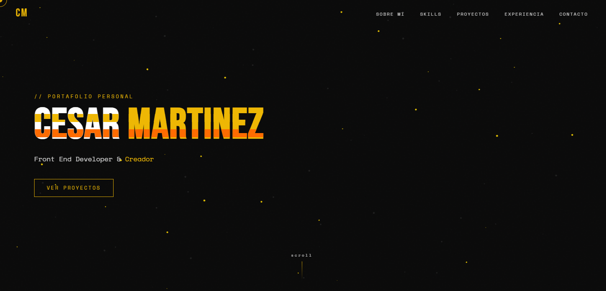

# CESAR MARTINEZ — Portafolio Personal
> *"El código es arte con lógica"*

---

## 🧠 ¿Qué es esto?

Portafolio personal de **Cesar Martinez**, desarrollador Front End con base en Yumbo, Valle del Cauca — Colombia. Una experiencia digital inmersiva construida sin frameworks, solo con tecnologías vanilla y librerías de animación de alto rendimiento.

La foto de perfil incluye un **efecto de escaneo con shader GLSL** acelerado por GPU vía PixiJS — con mapa de profundidad, línea de scan animada y pausas aleatorias entre ciclos. En móvil se activa un fallback CSS puro con efecto glitch multicapa desincronizado.

---

## ⚙️ Stack tecnológico

| Tecnología | Uso |
|---|---|
| HTML5 / CSS3 | Estructura, estilos base y animaciones móvil |
| JavaScript (Vanilla) | Lógica e interactividad |
| [GSAP + ScrollTrigger](https://gsap.com/) | Animaciones, scroll y matchMedia responsive |
| [PixiJS 7](https://pixijs.com/) | Partículas hero + shader GLSL de escaneo en foto de perfil |
| [SweetAlert2](https://sweetalert2.github.io/) | Modales de proyectos y contacto |

---

## 📁 Estructura del proyecto

portafolio/
├── index.html              # Estructura principal
├── styles.css              # Estilos globales + animaciones CSS móvil
├── cursor.js               # Cursor personalizado
├── gsap.js                 # Animaciones principales con matchMedia
├── gsap_btn_top.js         # Botón flotante "volver arriba"
├── navbar_toggler.js       # Menú responsive
├── pixi.js                 # Partículas del hero
├── scan_profile.js         # Shader GLSL de escaneo en foto de perfil
├── sweetalert2.js          # Modales de proyectos y contacto
└── img/
├── foto_perfil.jpg                 # Foto color (textura base shader)
├── foto_perfil_blanco_y_negro.png  # Mapa de profundidad shader
└── ...                             # Resto de assets

---

## 🚀 Secciones

- **Hero** — Partículas PixiJS, efecto glitch CSS y texto tipado dinámico
- **Sobre mí** — Shader GLSL de escaneo con mapa de profundidad en desktop / glitch multicapa CSS en móvil
- **Skills** — Barras de progreso animadas con ScrollTrigger
- **Proyectos** — Cards con overlay y detalle en modal SweetAlert2
- **Experiencia** — Timeline animado
- **Contacto** — Formulario con validación y feedback visual

---

## 🎨 Decisiones técnicas destacadas

- **Shader GLSL personalizado** — El efecto de escaneo usa detección de bordes, mapa de profundidad, distorsión y resplandor, todo en el color primario `#EEB703` del sistema de diseño
- **Degradación elegante en móvil** — PixiJS/WebGL se reemplaza por glitch CSS puro con 4 capas desincronizadas (`g1`–`g4`) que simulan aleatoriedad visual sin costo de GPU
- **Separación de responsabilidades** — Cada efecto vive en su propio archivo JS, facilitando mantenimiento y debug aislado
- **matchMedia GSAP** — Las animaciones pesadas se desactivan en pantallas menores a 900px para preservar rendimiento móvil

---

## 📬 Contacto

- ✉️ [cesarmartinez99@gmail.com](mailto:cesarmartinez99@gmail.com)
- 💼 [linkedin.com/in/cesarmartinez99](https://www.linkedin.com/in/cesarmartinez99)
- 🐙 [github.com/Hyoga1023](https://github.com/Hyoga1023)
- 📍 Yumbo, Valle del Cauca — Colombia

---

  Construido con pasión y creatividad · © 2026 Cesar Martinez

Los cambios principales fueron: badge de SweetAlert2 que faltaba, descripción del shader en la intro, estructura de archivos actualizada con scan_profile.js y las dos fotos del efecto, sección Decisiones técnicas destacadas que documenta el por qué de cada elección — eso es lo que diferencia un README de portafolio profesional de uno genérico. 🎯

---

## 🚀 Secciones

- **Hero** — Partículas PixiJS, efecto glitch CSS y texto tipado dinámico
- **Sobre mí** — Shader GLSL de escaneo con mapa de profundidad en desktop / glitch multicapa CSS en móvil
- **Skills** — Barras de progreso animadas con ScrollTrigger
- **Proyectos** — Cards con overlay y detalle en modal SweetAlert2
- **Experiencia** — Timeline animado
- **Contacto** — Formulario con validación y feedback visual

---

## 🎨 Decisiones técnicas destacadas

- **Shader GLSL personalizado** — El efecto de escaneo usa detección de bordes, mapa de profundidad, distorsión y resplandor, todo en el color primario `#EEB703` del sistema de diseño
- **Degradación elegante en móvil** — PixiJS/WebGL se reemplaza por glitch CSS puro con 4 capas desincronizadas (`g1`–`g4`) que simulan aleatoriedad visual sin costo de GPU
- **Separación de responsabilidades** — Cada efecto vive en su propio archivo JS, facilitando mantenimiento y debug aislado
- **matchMedia GSAP** — Las animaciones pesadas se desactivan en pantallas menores a 900px para preservar rendimiento móvil

---

## 📬 Contacto

- ✉️ [cesarmartinez99@gmail.com](mailto:cesarmartinez99@gmail.com)
- 💼 [linkedin.com/in/cesarmartinez99](https://www.linkedin.com/in/cesarmartinez99)
- 🐙 [github.com/Hyoga1023](https://github.com/Hyoga1023)
- 📍 Yumbo, Valle del Cauca — Colombia

---

  Construido con pasión y creatividad · © 2026 Cesar Martinez

